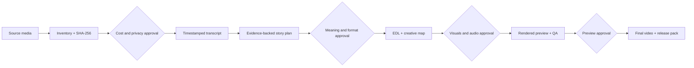

# Videomontazhka

English · [Русский](README.ru.md)

**Videomontazhka** is an installable Codex plugin for transcript-led local video editing. It inventories source media, prepares a hash-bound transcription workflow, proposes an evidence-backed story structure, builds an edit decision list, renders approved graphics and audio, checks the result, and prepares a release pack.

Status: **public beta 0.1.1**. The currently supported target is Codex on macOS with Apple Silicon. The source is public under Apache License 2.0; beta limitations and third-party terms remain documented below.

Videomontazhka is an independent project by Aleksei Ulyanov. Codex, OpenAI, ElevenLabs, GSAP, Browser Use, FFmpeg, and other third-party names are used only to describe compatibility and provenance; their mention does not imply endorsement or affiliation.

The distributed product is the complete source repository plus its automated installer. Prebuilt Python/Node runtimes, binary dependencies, `node_modules`, and user project/source packs are not distributed; the installer creates an isolated local environment from pinned direct dependencies and records the resolved transitive inventory in the runtime manifest.

## From source media to a verified release



Every gate preserves a visible decision boundary: the plugin does not spend money, lock the story, produce expensive assets, or render the final deliverable before the corresponding approval.

## Safety model

The workflow stops at four explicit approval gates:

| Gate | What the user reviews | What remains blocked |
|---|---|---|
| 1. Cost and privacy | Exact source paths and SHA-256 hashes, duration, provider, cache state, upload inventory, and approved minute limit | Any paid transcription request |
| 2. Meaning and format | Evidence with timecodes, hook options, structure, target duration, and deliverables | EDL creation, cutting, and asset production |
| 3. Visuals and audio | Routed creative plan, visible text, graphics, music/SFX choices, and representative frames | Full visual/audio production |
| 4. Preview | A QA-checked preview and its render manifest | Final render and release pack |

Product scripts are designed to treat source media as read-only and to write project state under `<videos_dir>/edit/`. Product runtimes and one-shot transcription approval markers live in configurable per-user application data outside the repository and video project. Verify source hashes and the final release pack for each project.

## What it can do

- Inventory a long stream, multiple takes, or mixed footage without changing source files.
- Bind manifests and reusable caches to source SHA-256 hashes.
- Use word-timestamped transcription when an approved provider supports it.
- Build an evidence-backed semantic plan with source IDs and exact timecodes.
- Remove fillers, false starts, duplicate takes, and dead air while preserving intentional pauses and meaning.
- Build horizontal videos and vertical shorts from presenter, screen, B-roll, and multi-source material.
- Add approved captions, titles, chapters, diagrams, comparisons, process cards, local motion elements, virtual camera moves, and local SFX.
- Render through FFmpeg, verify cut boundaries and provenance, and bind the final output to the approved preview.
- Prepare titles, a full description, chapters, hashtags, upload tags, subtitles, checksums, and a release report.

Capabilities are conditional on `doctor.py`. An optional engine or FFmpeg filter is not treated as available until the local runtime check confirms it.

## Requirements

- macOS on Apple Silicon (`arm64`)
- a current Codex installation
- Git and access to GitHub
- Python 3.11 or newer
- local `ffmpeg` and `ffprobe`

Linux and Windows are not supported beta targets. ElevenLabs and optional visual engines are not required for installation or offline checks.

## Quick start

```bash
git clone https://github.com/AlekseiUL/videomontazhka.git
cd videomontazhka
brew install ffmpeg python@3.12
python3.12 --version  # must report 3.11+
python3.12 plugins/videomontazhka/skills/videomontazhka/scripts/install_runtime.py --install
"$HOME/Library/Application Support/Videomontazhka/runtime/python/bin/python" \
  plugins/videomontazhka/skills/videomontazhka/scripts/install_runtime.py --verify-only
"$HOME/Library/Application Support/Videomontazhka/runtime/python/bin/python" \
  plugins/videomontazhka/skills/videomontazhka/scripts/doctor.py --json
```

Do not assume that `/usr/bin/python3` is recent enough. Some macOS versions ship Python 3.9. The installer fails before creating a runtime when invoked with Python older than 3.11.

The ordinary Homebrew FFmpeg build may omit the `subtitles` or `zscale` filters. `doctor.py` reports this explicitly. Burned subtitles and HDR tonemapping are not ready until the installed FFmpeg build provides the required filters; sidecar subtitles and non-HDR paths remain separate capabilities.

Add `.agents/plugins/marketplace.json` as a local marketplace in Codex and install **Videomontazhka**. If the current Codex build does not expose local marketplaces, use the compatible skill link:

```bash
mkdir -p ~/.codex/skills
ln -sfn "$PWD/plugins/videomontazhka/skills/videomontazhka" ~/.codex/skills/videomontazhka
```

Open a folder containing your source media in Codex and start with a bounded request:

> Use $videomontazhka. Inventory this folder and show the transcription preflight. Do not make any paid call.

The expected first project-folder mutation is a new `<videos_dir>/edit/` directory; product runtime and one-shot marker state are stored separately in per-user application data. Verify source hashes before and after the exercised workflow.

## Runtime and network boundaries

`install_runtime.py --install` is the only base-runtime command allowed to contact a package index. It creates a new isolated environment and refuses to overwrite an existing target. `--verify-only`, `doctor.py`, tests, inventory, planning, EDL validation, rendering, and QA do not make paid API calls.

The beta implements one network transcription provider: ElevenLabs Scribe. A key may be read only from the process environment or an explicitly selected product `.env` outside the repository and video project. A configured key is not spending approval. Every uncached upload requires a hash-bound preflight, an explicit minute limit, and a new one-shot approval. Ambiguous network outcomes are not retried automatically.

External photos, video, music, fonts, and SFX require recorded source and license information. Optional HyperFrames, Manim, browser, or GSAP paths remain opt-in; GSAP is not vendored and keeps its own terms.

See [installation](docs/INSTALL.md), [workflow](docs/WORKFLOW.md), [architecture](docs/ARCHITECTURE.md), [privacy and cost](docs/PRIVACY_AND_COST.md), [troubleshooting](docs/TROUBLESHOOTING.md), and [security](SECURITY.md).

## Project outputs

A typical project keeps all mutable state under `edit/`:

```text
videos/
├── source-01.mp4
├── source-02.mov
└── edit/
    ├── project.json
    ├── source_manifest.json
    ├── transcription_preflight.json
    ├── transcription_approval.json
    ├── transcription_attempts.jsonl
    ├── transcripts/
    ├── takes_packed.md
    ├── semantic_plan.json
    ├── approval.json
    ├── creative_treatment_plan.json
    ├── creative_approval.json
    ├── creative/
    ├── edl_<deliverable>.json
    ├── <deliverable-preview>.mp4
    ├── preview_approval_<artifact-key>.json
    ├── <deliverable-final>.mp4
    ├── release_manifest_<artifact-key>.json
    └── release_pack.md
```

Individual intermediate names may evolve with schema versions. The supported workflow is designed to read source media without rewriting it and uses explicit approvals, hash-bound provenance, and final output bound to the approved preview. Verify source hashes for each project.

## Development and CI

Run the complete local suite with the managed runtime:

```bash
PY="$HOME/Library/Application Support/Videomontazhka/runtime/python/bin/python"
"$PY" -m compileall -q \
  plugins/videomontazhka/skills/videomontazhka/scripts \
  plugins/videomontazhka/skills/videomontazhka/tests
"$PY" -m unittest discover \
  -s plugins/videomontazhka/skills/videomontazhka/tests \
  -t plugins/videomontazhka/skills/videomontazhka \
  -p 'test_*.py'
```

Tests use synthetic data and no real user video or paid network request. The current GitHub Actions workflow runs on `macos-14`, parses JSON, validates plugin/marketplace/skill contracts, checks Markdown links and repository hygiene, compiles Python, and runs the standard-library safety subset without an API key. It does not claim the optional-engine matrix is installed.

See [CONTRIBUTING.md](CONTRIBUTING.md) and the [synthetic demo](examples/synthetic-demo/README.md).

## Beta limitations

- Only macOS/Apple Silicon is currently supported and checked.
- Editing quality depends on source quality and transcription accuracy; ambiguous decisions stay with the user.
- Optional adapters do not grant rights to third-party media, music, plugins, or fonts.
- FFmpeg is not distributed with the repository; the license and capability set depend on the local build.
- Large transcription preflight snapshots need temporary free space approximately equal to the largest approved source plus extracted WAV.
- Dependency locks with hashes and a broader macOS/FFmpeg version matrix remain pre-stable-release work. The historical `video-use` import commit was not recorded. [PROVENANCE.md](PROVENANCE.md) records the `verified default-branch revisions` and the remaining remote-ref provenance gap. A formal SBOM is required if a future release adds bundled runtimes or binaries.

Original Videomontazhka code is licensed under Apache License 2.0. Bundled, derived, and optional components retain their own licenses; see [THIRD_PARTY_NOTICES.md](THIRD_PARTY_NOTICES.md), [DEPENDENCIES.md](DEPENDENCIES.md), and [PROVENANCE.md](PROVENANCE.md).

## Author resources

- [YouTube — Aleksei Ulyanov](https://youtube.com/@alekseiulianov)
- [GitHub — AlekseiUL](https://github.com/AlekseiUL)
- [SPRUT_AI](https://t.me/Sprut_AI) — public notes, cases, and AI tools
- [Telegram chat](https://t.me/+eH-qNIDmud8zNDZi) — questions and peer discussion
- [AI ОПЕРАЦИОНКА](https://t.me/tribute/app?startapp=sJyg) — ready projects, working files, guides, and detailed implementation notes
