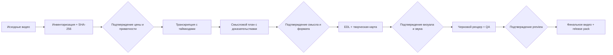

# Видеомонтажка

[English](README.md) · Русский

**Видеомонтажка** — устанавливаемый плагин для Codex, который превращает папку с исходниками в осмысленный готовый ролик: инвентаризирует материалы, транскрибирует речь, предлагает смысловую структуру, удаляет лишние повторы и паузы, строит монтаж, добавляет графику и звук, проверяет результат и готовит публикационный пакет.

Статус: **public beta 0.1**. Первая поддерживаемая конфигурация — Codex на macOS с Apple Silicon. Исходный код открыт по Apache License 2.0; ограничения beta и условия сторонних компонентов перечислены ниже.

Видеомонтажка — независимый проект Алексея Ульянова. Названия Codex, OpenAI, ElevenLabs, GSAP, Browser Use, FFmpeg и других сторонних продуктов используются только для описания совместимости и происхождения; их упоминание не означает одобрение или официальную связь.

Поставляемый продукт — полный исходный репозиторий и автоматический установщик. Готовые Python/Node runtimes, бинарные зависимости, `node_modules` и пользовательские project/source packs не распространяются: установщик создаёт изолированную среду локально из зафиксированных прямых зависимостей; фактический транзитивный состав сохраняется в runtime manifest.

## От исходников до проверенного релиза



Каждый шлюз сохраняет понятную границу решения: плагин не тратит деньги, не фиксирует смысл, не производит дорогие ассеты и не запускает финальный рендер без соответствующего подтверждения.

## Главное правило

Агент не начинает дорогой или необратимый этап молча. Конвейер разделён на четыре подтверждения:

| Шлюз | Что человек видит | Что блокируется до подтверждения |
|---|---|---|
| 1. Стоимость и приватность | Точные пути и hashes файлов, отметка выхода за папку проекта, длительность, провайдер и объём потенциально платного аудио | Обращение к платному API |
| 2. Смысл и формат | Фактические тезисы с таймкодами, варианты хука, структура, целевая длительность и форматы | EDL, вырезание и производство ассетов |
| 3. Визуал и звук | Маршрутизированная творческая карта, тексты, стили графики, музыка/SFX и контрольные кадры | Финальная сборка визуалов и звукового решения |
| 4. Preview | Проверенный черновой ролик и QA-отчёт | Финальный рендер и релизный пакет |

Если выбор не влияет на цену, смысл или существенную переделку, агент принимает консервативное решение сам. Если влияет — задаёт один короткий вопрос с конкретными вариантами. Так не тратятся токены, минуты API и время рендера на догадки.

## Что умеет

- Инвентаризировать один длинный стрим, набор дублей или смешанную папку в режиме чтения; штатные проектные результаты писать в `<videos_dir>/edit/`. Для каждого проекта проверяйте исходные hashes и release pack.
- Создавать привязанный к SHA-256 манифест источников и повторно использовать только актуальные кэши.
- Получать пословную транскрипцию с таймкодами, определять говорящих и сохранять события аудио, когда это поддерживает выбранный провайдер.
- Читать видео как компактные текстовые доказательства и запрашивать кадры только в неоднозначных местах.
- Вынимать реальные смыслы, обещание зрителю, аудиторию, хук, драматургию, связки и финальный вывод.
- Сокращать длинный материал без подмены мысли; убирать «э-э», «м-м», ложные старты, дубли и мёртвый воздух, сохраняя намеренные паузы и дыхание речи.
- Собирать горизонтальные ролики и вертикальные шорты, работать с ведущим, экраном, несколькими источниками и B-roll.
- Добавлять титры, главы, субтитры, диаграммы, сравнения, процессные схемы, цитаты, CTA, локальные motion-элементы и виртуальную камеру.
- Полировать речь и громкость, добавлять локальные SFX; использовать hard cut по умолчанию, а иной переход — только через готовый и проверенный adapter.
- Проверять границы склеек, чёрные кадры, A/V-параметры, происхождение ассетов и соответствие финала одобренному preview.
- Готовить финальный MP4, субтитры, три варианта названия, полное описание, главы, хэштеги и строку тегов для загрузки.

## Быстрый старт

Требуются Codex, Git, Python 3.11+ и локальные `ffmpeg`/`ffprobe`. Платный аккаунт не нужен для установки или проверки. ElevenLabs используется только по явному выбору пользователя.

```bash
git clone https://github.com/AlekseiUL/videomontazhka.git
cd videomontazhka
brew install ffmpeg python@3.12
python3.12 plugins/videomontazhka/skills/videomontazhka/scripts/install_runtime.py --install
"$HOME/Library/Application Support/Videomontazhka/runtime/python/bin/python" \
  plugins/videomontazhka/skills/videomontazhka/scripts/doctor.py
```

В Codex добавьте локальный marketplace из `.agents/plugins/marketplace.json` и установите плагин **Видеомонтажка**. Если текущая версия Codex ещё не показывает локальные marketplaces, доступен совместимый ручной вариант:

```bash
mkdir -p ~/.codex/skills
ln -sfn "$PWD/plugins/videomontazhka/skills/videomontazhka" ~/.codex/skills/videomontazhka
```

После установки откройте в Codex папку с исходниками и напишите, например:

> Используй $videomontazhka. Собери из этой папки цельный YouTube-ролик примерно на 15–18 минут. До любых платных вызовов покажи объём транскрибации, затем предложи смысловой план и дождись моего подтверждения.

Внутри папки проекта штатные команды пишут в `<videos_dir>/edit/`; product runtime и one-shot markers размещаются отдельно в per-user application data. Перед релизом сверяйте исходные hashes.

## Результат проекта

Типовая структура рабочей папки:

```text
videos/
├── source-01.mp4
├── source-02.mov
└── edit/
    ├── project.json
    ├── source_manifest.json
    ├── transcription_preflight.json
    ├── transcription_approval.json
    ├── transcription_attempts.jsonl
    ├── transcripts/
    ├── takes_packed.md
    ├── takes_packed_manifest.json
    ├── semantic_plan.json
    ├── approval.json
    ├── creative/
    ├── edl_<deliverable>.json
    ├── <deliverable-preview>.mp4
    ├── render_manifest_<artifact-key>_preview.json
    ├── preview_approval_<artifact-key>.json
    ├── <deliverable-final>.mp4
    ├── release_manifest_<artifact-key>.json
    └── release_pack.md
```

Точные имена отдельных промежуточных файлов могут развиваться вместе со схемами, но четыре подтверждения, чтение источников без штатной перезаписи и проверяемая цепочка происхождения являются контрактом поддерживаемого контура. Перед релизом сверяйте исходные hashes.

## Установка зависимостей

Базовая цепочка использует системный FFmpeg и изолированные локальные Python/Node runtimes. Большие среды, `node_modules`, модели, пользовательские видео и API-ключи в репозиторий не входят. `install_runtime.py --install` — единственная базовая команда, которой разрешено обратиться к package index; она создаёт новое окружение и не перезаписывает существующее.

```bash
brew install ffmpeg python@3.12
python3.12 --version  # должно быть 3.11+
python3.12 plugins/videomontazhka/skills/videomontazhka/scripts/install_runtime.py --install
"$HOME/Library/Application Support/Videomontazhka/runtime/python/bin/python" \
  plugins/videomontazhka/skills/videomontazhka/scripts/install_runtime.py --verify-only
"$HOME/Library/Application Support/Videomontazhka/runtime/python/bin/python" \
  plugins/videomontazhka/skills/videomontazhka/scripts/doctor.py --json
```

Не полагайтесь на непроверенный `/usr/bin/python3`: в некоторых версиях macOS
это Python 3.9, который не соответствует контракту beta. Инсталлятор теперь
останавливается до создания runtime и показывает явную ошибку, если запущен на
Python ниже 3.11.

Дополнительные визуальные движки ставятся только тогда, когда их выбрала творческая карта. Перед установкой или загрузкой агент показывает, зачем нужен компонент и какие у него лицензионные условия.

## Безопасность расходов и данных

- Ключи читаются из окружения или явно указанного продуктового `.env` вне репозитория и проекта.
- До ElevenLabs агент обязан показать точный upload inventory: абсолютный путь, source ID, SHA-256, длительность, состояние кэша, `will_upload` и факт нахождения вне папки проекта.
- Подтверждение связано с этим набором файлов, раскрытием внешней загрузки, пределом минут и дословной цитатой пользователя. Оно разрешает не более одной HTTP-попытки на каждый source.
- Денежная оценка не зашита в код: тарифы меняются. Источником истины остаётся текущий тариф аккаунта; продукт считает минуты и фиксирует одобренный предел.
- Повторный запуск использует транскрипцию только при совпадении хэша источника, провайдера и модели.
- До HTTP одноразовая capability атомарно погашается в приватном per-user реестре вне проекта, а начало попытки фиксируется в проектном hash-chain журнале. Поэтому удаление/откат `edit/`, таймаут или неоднозначный ответ не запускают скрытый повтор: нужен новый preflight и новое явное подтверждение.
- Approval намеренно привязан к текущему application home и абсолютному пути проекта. После переноса проекта на другой Mac или потери локального реестра платная транскрибация блокируется до нового подтверждения; готовые transcript artifacts остаются обычными локальными файлами.
- Сетевой вызов не является частью тестов, CI или `doctor`.
- Внешние фото, видео, музыка и SFX допускаются только с зафиксированным источником и лицензией.

Подробнее: [приватность и стоимость](docs/PRIVACY_AND_COST.md) и [безопасность](SECURITY.md).

## Документация

- [Установка](docs/INSTALL.md)
- [Рабочий процесс и подтверждения](docs/WORKFLOW.md)
- [Архитектура и артефакты](docs/ARCHITECTURE.md)
- [Приватность и стоимость](docs/PRIVACY_AND_COST.md)
- [Диагностика](docs/TROUBLESHOOTING.md)
- [Публикационный пакет](docs/RELEASE_PACK.md)
- [Зависимости](DEPENDENCIES.md)
- [Происхождение кода и решений](PROVENANCE.md)
- [Сторонние лицензии](THIRD_PARTY_NOTICES.md)

## Границы beta

- Официально проверяется macOS/Apple Silicon; Linux и Windows пока не являются поддерживаемыми целями.
- Качество смыслового монтажа зависит от качества записи и точности транскрипции; спорные места требуют решения человека.
- Встроенные адаптеры не дают права на чужие медиа, музыку, плагины или шрифты вне явно указанных лицензий.
- GSAP — опциональный невендоренный компонент с собственными условиями, а не open-source-зависимость проекта.
- FFmpeg не распространяется с репозиторием: конкретная лицензия локальной сборки зависит от её флагов и кодеков.
- Перед платной транскрибацией beta делает проверяемый private snapshot source; для очень больших файлов нужен временный свободный объём примерно с размер крупнейшего source плюс извлечённый WAV.

## Разработка

См. [CONTRIBUTING.md](CONTRIBUTING.md). Все тесты используют синтетические данные, не обращаются к платным API и не требуют пользовательских видео. Минимальный безмедийный сценарий находится в [examples/synthetic-demo](examples/synthetic-demo/README.md).

Оригинальный код Видеомонтажки лицензирован по Apache License 2.0. Заимствованные и опциональные компоненты сохраняют собственные лицензии; подробности приведены в [THIRD_PARTY_NOTICES.md](THIRD_PARTY_NOTICES.md).

## Ресурсы автора

- [YouTube — Алексей Ульянов](https://youtube.com/@alekseiulianov)
- [GitHub — AlekseiUL](https://github.com/AlekseiUL)
- [SPRUT_AI](https://t.me/Sprut_AI) — открытые заметки, кейсы и инструменты
- [Telegram-чат](https://t.me/+eH-qNIDmud8zNDZi) — вопросы и обмен опытом
- [AI ОПЕРАЦИОНКА](https://t.me/tribute/app?startapp=sJyg) — готовые проекты, рабочие файлы, гайды и подробные разборы
